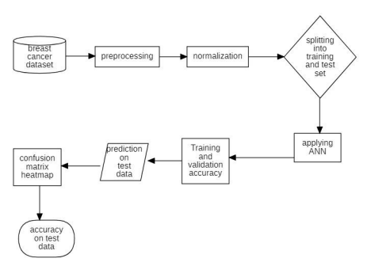
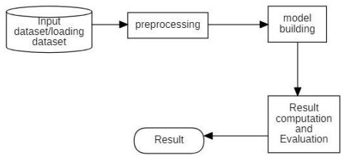
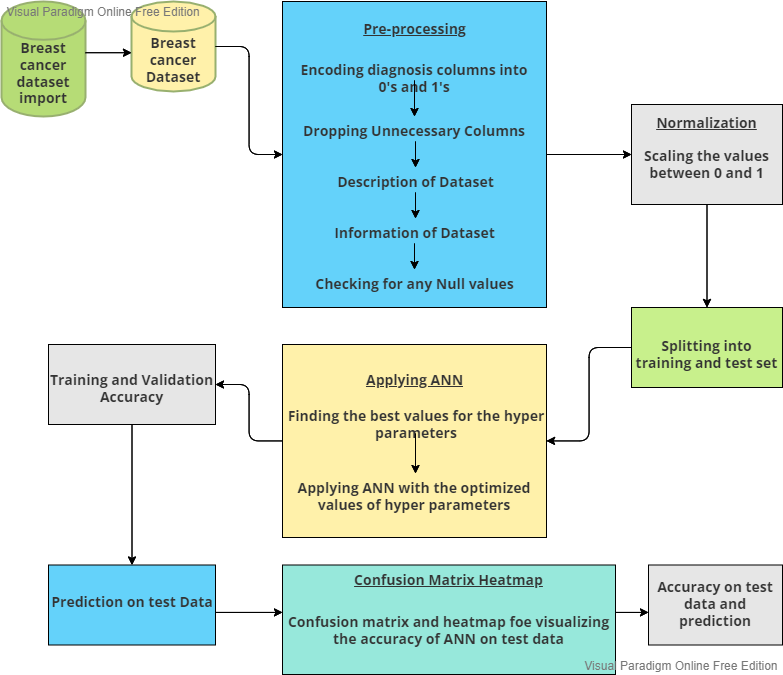
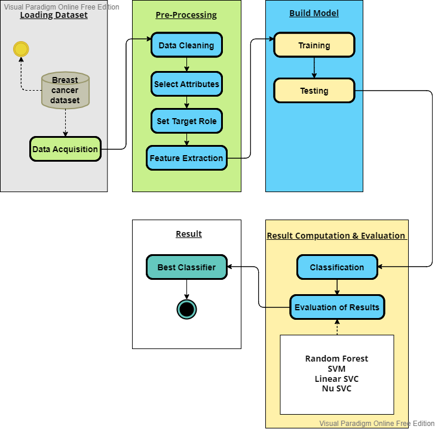
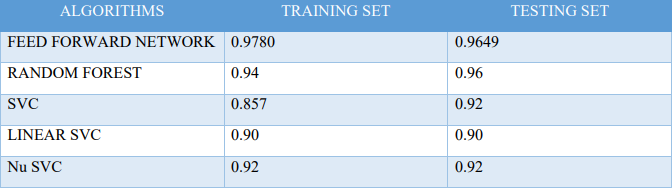

# Breast Cancer Detection Using ANN and ML

## Description
In recent decades Artificial neural network and ML strategies have been broadly utilized in human services frameworks, particularly for bosom malignant growth (BC) determination and forecast. As of late, ML and ANN methods are assuming a critical job in determination of BC by applying characterization strategies to recognize individuals with BC, recognize generous from threatening tumours and to foresee climate the patient is influenced or not Here we apply Feed forward ANN and apply machine learning algorithms like Random Forest, SVM, Linear SVC, nuSVC and finally compute which has higher accuracy and best for detection of breast cancer.

## Design
* ANN

* ML

## Modules

* Breast Cancer Database
* Data Pre-processing
* Training
* Testing
* Performance Comparison
* Results

## WorkFlow

* ANN

* ML

## Methodologies
* Feed forward neural network
* Support Vector Machine (SVM)
* Random Forest
* Linear SVC
* NuSVC Nu-Support Vector Classification. 

## Tools
* Juupyter Notebook
* Visual Studio

## Dataset
I have used the Breast Cancer Wisconsin (Original) dataset from UCI machine learning repository is a classification dataset, which records the measurements for breast cancer cases. There are two classes, benign and malignant. This dataset has dimensionality 9. The malignant class of this dataset is considered as outliers, while points in the benign class are considered inliers.
[WDBC](https://archive.ics.uci.edu/ml/datasets/Breast+Cancer+Wisconsin+%28Diagnostic%29)

## Results

